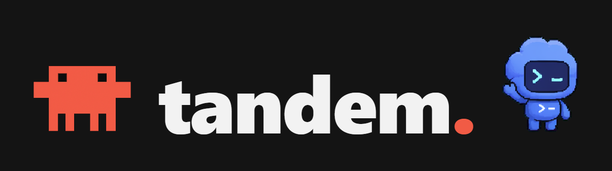
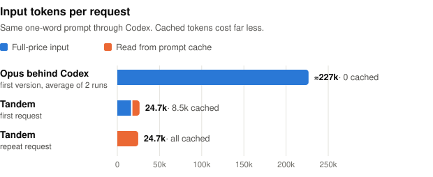

<h1 align="center"></h1>

<p align="center"><b>Use Claude Code as a model in the Codex desktop app.</b></p>

Tandem adds **Claude Opus 5.5 (Claude Code)** to the Codex model picker, next to your GPT models. Your own Claude Code installation runs the agent loop (its prompt, read and search tools, web tools, skills, subagents, MCP servers and `CLAUDE.md`), while Codex runs the shell commands and file edits with its normal approvals and shows them as its own command and diff cards. GPT keeps working exactly as before.

> [!WARNING]
> Tandem is an independent, experimental project, not affiliated with or endorsed by Anthropic or OpenAI. It uses **your** Claude Code installation and **your** Claude login or API key, so your agreement with Anthropic governs that usage. Read [Terms and account risk](#terms-and-account-risk) before using it with a Claude subscription.

> [!TIP]
> **Why Claude Code runs as the harness, instead of plugging Opus into Codex directly**
>
> Tandem's first version treated Opus as a bare model behind Codex. It was dropped because:
>
> - **Your Claude login sat in the middle.** A local relay forwarded your login token and edited Claude Code's requests. Now the unmodified CLI talks straight to Anthropic and Tandem never sees your token.
> - **It used Claude Code as a model API.** Tandem runs Claude Code as Claude Code, which is much closer to ordinary use. It is still a third-party front end, so the warning above applies.
> - **It cost far more.** Codex sends every tool definition it has with each request:
>
> <picture>
>   <source media="(prefers-color-scheme: dark)" srcset="docs/token-benchmark-dark.svg">
>   
> </picture>
>
> Either way, Codex runs every command and edit, and GPT requests and OpenAI credentials never reach Claude Code.

## How it works

```
Codex desktop ──► local router ──┬─ GPT ─────────► OpenAI (unchanged request, your OpenAI login)
                                 └─ Claude Code ─► local bridge ─► claude -p (your Claude login)
                                                                     └─ commands and edits ─► back to Codex as native tool calls
```

Enabling Tandem points Codex's `openai_base_url` at a local router and adds one model to the catalog Codex reads. The router passes GPT traffic straight to OpenAI. The Claude Code model goes to a local bridge that keeps one Claude Code session per chat. Claude Code's own shell and edit tools are turned off; it gets Codex's `exec_command`, `write_stdin` and `apply_patch` instead, and each call is handed to Codex to run, then its result goes back to Claude Code.

## Requirements

- **Windows 10/11** (the only tested platform)
- **Codex desktop**, signed in with ChatGPT, plus the **Codex CLI** for installing (tested: app 26.924, CLI 0.157)
- **Claude Code**, signed in with access to Claude Opus 5.5 (tested: 2.1.283)
- Python 3.11+ with `cryptography` and Node.js 22.15+. Codex desktop's bundled runtimes are used automatically.

## Install

```powershell
codex plugin marketplace add Yuruzuu/tandem
codex plugin add tandem@tandem
```

Then open Codex, ask **"Enable Tandem"** and approve the tool call. Fully restart Codex and pick **Claude Opus 5.5 (Claude Code)**. Your GPT default stays selected for new chats.

Enabling changes only `openai_base_url` and `model_catalog_json` in `config.toml` and saves a backup. It refuses to run if you already use a custom provider or base URL.

## Good to know

- **Approvals:** commands and edits follow your Codex approval and sandbox settings. Claude Code's other tools (reads, web, its own MCP servers) run without Codex approval.
- **Not shared:** Codex's developer instructions, skills, plugins and MCP servers. Claude Code uses its own setup; your `AGENTS.md` and environment context are passed along.
- **Switching models** mid-chat works both ways, except after compaction: Claude Code can't read GPT's compacted history, and GPT only sees a pointer to a compacted Claude Code session. Start a fresh chat for those.
- **Sessions** resume automatically after interruptions and restarts, and idle ones stop after an hour.
- **Effort** in Codex maps to Claude Code's `--effort` (low to max).

## Uninstall and recovery

While Tandem is enabled, **all** Codex model traffic goes through its router, which the plugin starts when Codex loads. If Codex can't reach any model, or to uninstall, restore the direct route from a clone of this repo (works without Codex or the router running):

```powershell
git clone https://github.com/Yuruzuu/tandem
.\tandem\plugins\tandem\scripts\tandem.cmd restore-desktop   # or: start / status / stop
codex plugin remove tandem@tandem
codex plugin marketplace remove tandem
```

Restart Codex afterwards. Keep `%USERPROFILE%\.codex\tandem` if you might reinstall: it holds the key for Claude Code turns in existing chats, plus your config backups.

| Environment variable | Purpose |
|---|---|
| `TANDEM_HOME` | Private state folder (default `%USERPROFILE%\.codex\tandem`) |
| `TANDEM_PYTHON`, `TANDEM_NODE`, `TANDEM_CLAUDE` | Override the Python, Node.js or `claude` executable |

## Security

Everything runs on loopback (`127.0.0.1:57855` and `:57856`) behind random secrets, and browser requests are rejected. GPT requests go unchanged to the fixed `chatgpt.com/backend-api/codex` endpoint; the only edit is removing Tandem's own encrypted items when a chat switches from Claude Code to GPT. Tandem never reads your OpenAI or Claude credential files. Report vulnerabilities privately: see [SECURITY.md](SECURITY.md).

## Terms and account risk

Tandem runs the official, unmodified Claude Code with your own login or API key, billed to your own account, and never handles your Claude credentials. Anthropic's [legal and compliance page](https://code.claude.com/docs/en/legal-and-compliance) describes subscription (Free, Pro, Max) sign-in as intended for ordinary use of Claude Code and Anthropic's own apps, and says it may enforce its restrictions without notice. Using a subscription through another app's interface may fall outside that, and you are responsible for deciding whether your use complies. For certainty, sign Claude Code in with an [Anthropic API key](https://platform.claude.com/). OpenAI's terms continue to apply to the GPT traffic Tandem forwards.

## Development

```powershell
cd plugins\tandem
python -B -m unittest discover -s tests -p "test_*.py" -v
$env:PYTHON = "python"; node --test tests/router.test.cjs
```

The tests run offline with a fake `claude` process. Main pieces: `scripts/router.cjs` (router), `scripts/bridge.py` and `scripts/harness.py` (Claude Code sessions and the Codex relay), `scripts/control.py` (setup and restore). See [CONTRIBUTING.md](CONTRIBUTING.md).

## Acknowledgements and license

Helpers in `scripts/native/cli.py` are adapted from Nous Research's [hermes-plugin-claude-subscription-directsdk](https://github.com/NousResearch/hermes-plugin-claude-subscription-directsdk) (MIT, see [its license](plugins/tandem/scripts/native/LICENSE)). Tandem is released under the [MIT License](LICENSE).
